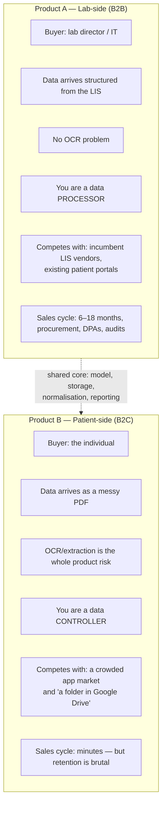
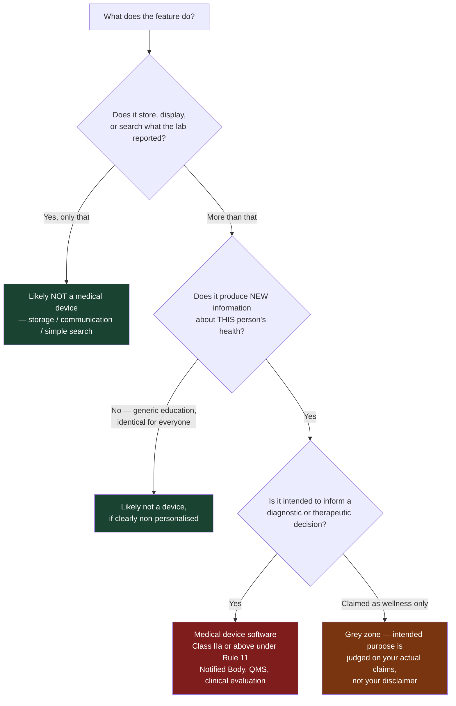
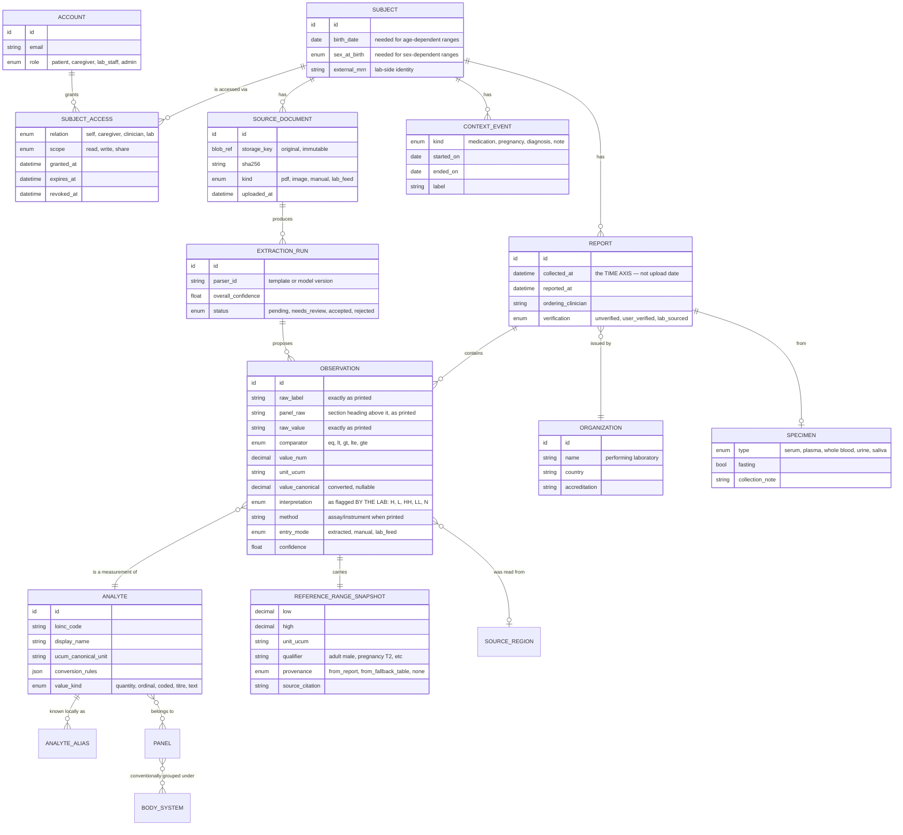
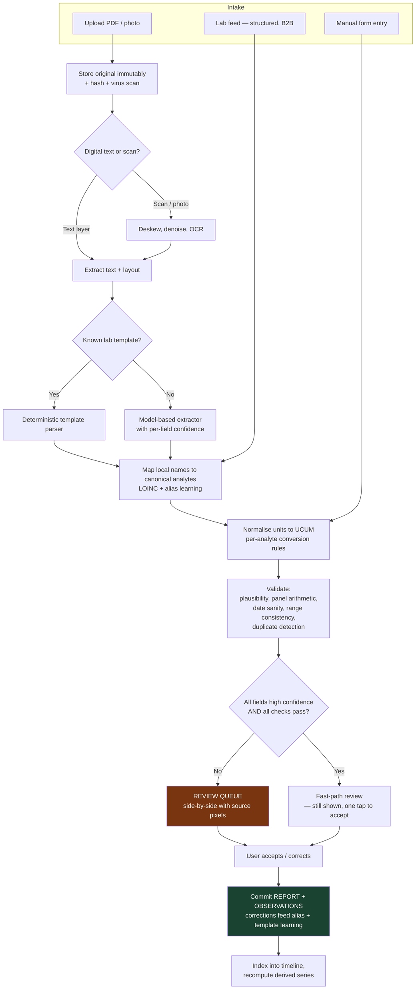
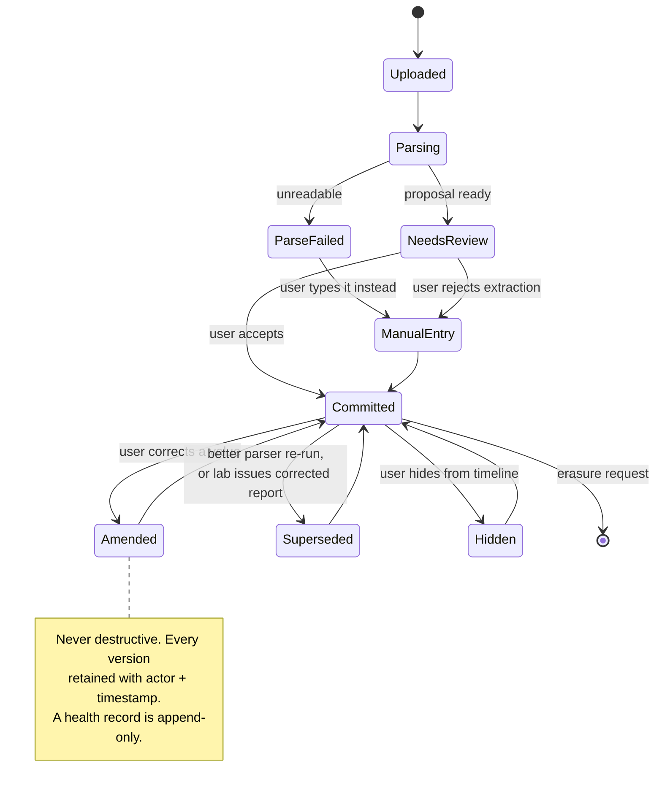
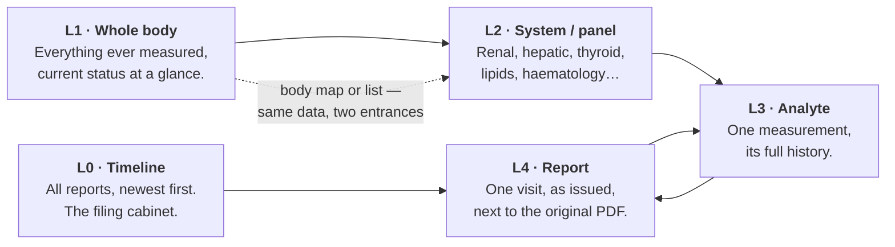
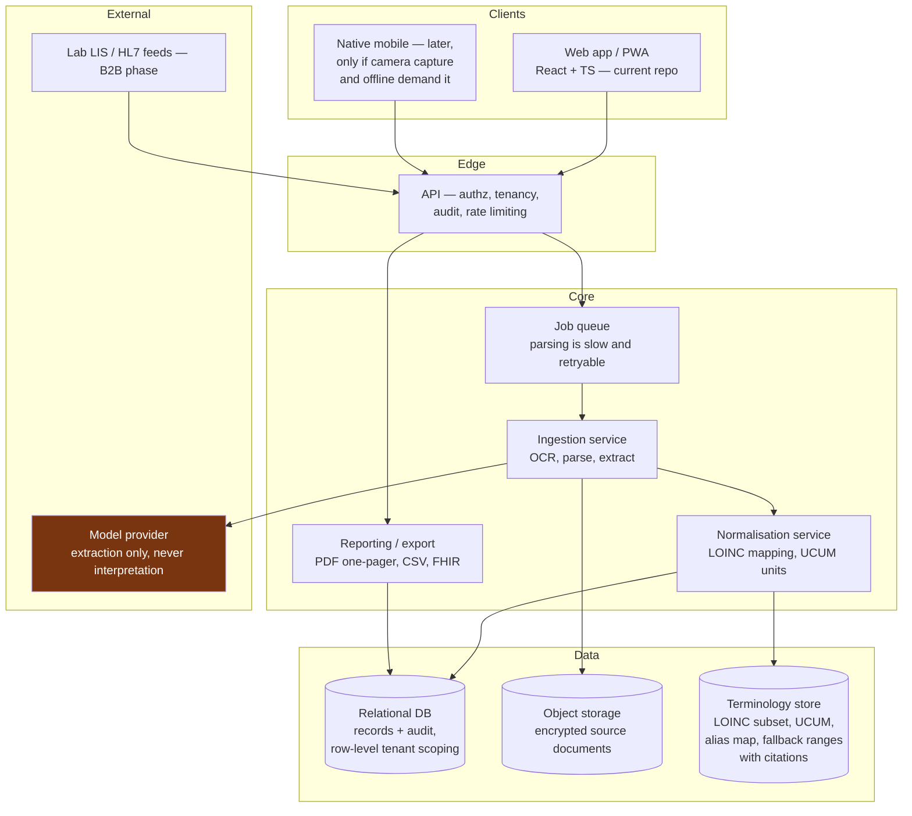
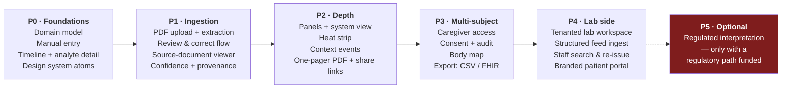

# LabScope — Product Vision & High-Level Architecture

**Status:** Draft 1 — foundational thinking, pre-implementation.
**Date:** 2026-08-12
**Scope:** Everything here is at the "what and why" altitude. No API signatures, no schemas in SQL, no component trees. Those come after this document is agreed.
**Maintenance:** This is the source of truth for product direction. It is checked and updated on every change or implementation — see the rules in `CLAUDE.md`.
**Rendered copy:** https://claude.ai/code/artifact/b02aa97d-0e72-4ecb-ada7-195ef7cb159f (republish this same file path to update it in place)

---

## 0. One paragraph

LabScope is a **longitudinal record system for diagnostic results**. A patient's lab reports — PDFs from any laboratory, or values typed by hand — are turned into structured, unit-normalised, provenance-tracked data points, and then presented as a history: what a value was, where it sits against *the range the issuing lab printed on that report*, how it has moved, and how it relates to the other analytes measured with it. It is used from two sides: laboratories operate it as a patient-facing layer over the results they already produce, and patients use it as their own permanent, portable record spanning every lab they have ever visited. The product's defensible core is not charts — charts are commodity — it is **trustworthy longitudinal data across sources**, which nobody has solved well.

---

## 1. Your idea, restated — and what I changed

### What you said

> PDF or manual entry → graphical view → split by organ / whole body / single analysis → per-patient history → labs use it for all their patients, patients get accounts → a "CRM" for patient historical data, with a medical design system.

### What survives untouched

- **Historical data is the product.** Correct. A single result is a commodity that the lab already gives away on paper. The *sequence* is what nobody owns, and it is the thing that becomes more valuable every year a user stays.
- **Dual-sided (lab + patient).** Correct instinct, but it is a sequencing problem, not a "build both" problem. See §2.
- **Ingest by PDF or form.** Correct. Manual entry is not the fallback — it is the honest baseline, and it should be built *first* (see §14).
- **A dedicated medical design system.** Correct and underrated. This is a domain where visual conventions carry clinical meaning, and where a careless colour choice is a safety issue, not an aesthetic one.

### What I would change

| Your framing | My revision | Why |
|---|---|---|
| "A CRM for patients" | **A longitudinal record + reporting system.** Say "record", never "CRM". | CRM implies sales/relationship pipelines. What you're describing is a *system of record* with reporting on top. The distinction changes the data model, the retention rules, and the liability posture. |
| "Split by organ" | **Organ/system view is a navigation metaphor, not a verdict.** | Mapping analytes to organs and colouring the organ is a diagnostic claim. It is also the single fastest way to turn this into a regulated medical device. See §5. |
| "Gives you a graphical view of the details" | **Gives you your results, their provenance, and their movement.** | "Graphical view" undersells and misdirects. The hardest, most valuable work is upstream of the pixels. |
| One product for labs and patients | **One platform, two products, sequenced.** | Different buyers, different compliance posture (processor vs controller), different sales cycles. Building both simultaneously will produce something that serves neither. |
| Implicit: values are comparable over time | **Values are only comparable under stated conditions.** | Two results from two labs on one line chart can be clinically misleading. This is a first-class design constraint, not an edge case. |

### What is missing from your description entirely

1. **Who is legally responsible for the data being right?** This determines the entire product.
2. **The doctor.** The most valuable output of this app is probably a one-page PDF the patient hands to a physician in a 12-minute appointment. You didn't mention it; it may be the killer feature.
3. **Consent and sharing.** Family/caregiver access (a parent managing a child's results, an adult managing an elderly parent's) is a huge real-world need and a consent/audit minefield.
4. **Context capture.** Fasting state, time of day, medication, cycle phase. Without these, a "trend" is partly noise, and you will render noise beautifully.

---

## 2. The strategic fork — choose one wedge

You have described two businesses. They share a backend and share almost nothing else.



**The trap:** building the patient app and hoping labs adopt it. Labs will not adopt a consumer app; they buy systems with contracts, audit trails, and someone to sue.

**The opposite trap:** building the lab product first and discovering that the LIS integration work is 80% of the effort and every lab's LIS is different.

**My recommendation: B2B2C, patient-app-first, but built on a lab-shaped data model.**

Concretely:
1. Build the **patient product first**, because it validates the hard part (extraction, normalisation, history UX) with fast feedback and no procurement cycle.
2. But build the **data model as if a lab were feeding it** — FHIR-shaped, LOINC-coded, multi-tenant, audit-logged from day one. Retrofitting this later is a rewrite.
3. Land labs by offering the patient layer as **their** branded portal: the lab pushes structured results (no OCR), the patient gets a permanent history, the lab gets a retention/differentiation story and stops fielding "can you resend my results from 2023" phone calls. That is a real, boring, sellable pain.

The patient-first path also gives you the only asset labs can't replicate: the patient's results **from other labs**. A lab's own portal can never show that. That is your wedge, and it is a genuine one.

---

## 3. Users and what they're actually trying to do

| Actor | Real job-to-be-done | What they need that's not obvious |
|---|---|---|
| **Patient / individual** | "Am I better or worse than last time, and what do I bring to my appointment?" | Reassurance without alarm. Most out-of-range values are clinically trivial, and a red card produces anxiety disproportionate to the finding. |
| **Chronic patient** (thyroid, diabetes, CKD, anticoagulation) | "Is my treatment working?" — checks results every 3–6 months, for decades | This is your retention cohort and your most demanding user. They will notice unit errors before you do. |
| **Caregiver / proxy** | Manages someone else's results — a child, a parent with dementia | Delegated access with real consent semantics and revocability. Not "share my password". |
| **Physician (recipient, not user)** | "Give me the trend in 20 seconds" | They will not create an account. Serve them a printable/shareable one-pager. Optimise for *their* 20 seconds; the patient's satisfaction depends on how that hand-off goes. |
| **Lab front desk / customer service** | "Find this patient's report from 2021" | Search, re-issue, audit. Unglamorous, and it's what actually gets budget approved. |
| **Lab management** | Differentiation, retention, reduced support load | Cohort/ops reporting — *aggregate*, and legally distinct from clinical use. Treat as a separate later module. |

**A note on the "wellness optimiser" persona** (the biohacker who wants a biological-age score): they convert well and churn fast, and serving them pulls you toward exactly the interpretive claims that regulate you. Serve them incidentally, never design for them.

---

## 4. The five hard problems

Everything easy about this app is a solved commodity. These five are where the product is actually won or lost. Your current `src/App.tsx` — `{ name, value, unit, low, high }` — is wrong on four of the five, which is fine for a scaffold but is worth being explicit about.

### 4.1 A reference range is not a property of an analyte

There is no universal "normal range" for haemoglobin. Reference intervals are established or validated **per laboratory**, and depend on the analytical method and instrument, the reference population's demographics, age, sex, and sometimes pregnancy status, ethnicity, or altitude. Accredited labs are required to establish or validate their own, and results should be interpreted against the range of the lab that produced them.

**Consequence:** the reference range is an attribute of the **result**, captured from the report, not looked up from a global table. Your model must store the exact interval as printed, with its qualifier ("adult male", "3rd trimester", "on warfarin"), and treat any built-in table as a last-resort fallback that is visibly labelled as such.

This is also the reason the README's warning about invented ranges is not a nitpick: a global range table is not merely unsourced, it is *conceptually* wrong.

### 4.2 Units and analyte identity

- Glucose is mg/dL in the US, mmol/L in most of Europe. Conversion needs the molar mass — it's analyte-specific, not a generic unit conversion.
- Some analytes have *no* valid conversion between assay methods at all (many immunoassays, some hormones). Silent conversion is a safety bug.
- The same test is printed as "TSH", "Thyrotropin", "TSH 3rd gen", "Hormoni tiroidean" depending on lab and language. The local name is not an identifier.
- Values are not always numbers: `<0.01`, `>1000`, "Negative", "Trace", "1:160", "Not detected". A `value: number` field cannot represent these, and censored values (`<x`) plotted as `x` are a subtle lie.

**Consequence:** you need a canonical analyte identity (LOINC is the standard for this), a unit model with explicit UCUM codes, per-analyte conversion rules, and a value type that admits numeric, censored-numeric, ratio, ordinal, and coded results.

### 4.3 Cross-lab comparability — the thing nobody does well

Plotting a 2022 result from Lab A and a 2026 result from Lab B as a continuous line implies they are the same measurement. They may not be: different methods, different calibration, different reference intervals. This is *the* differentiator available to you, and it is a display problem with a data-model prerequisite.

**Design answer:** never hide the seam. When the performing lab, method, or unit changes mid-series, mark it on the chart (a vertical rule with a "method change" annotation), and let the user choose between "as reported" and a normalised view. Being the app that is *honest* about this is a real position in a market of apps that quietly interpolate.

Related: the meaningful question is not "did the number change" but "did it change more than measurement noise and normal biological fluctuation". The clinical-chemistry answer is the **reference change value**, computed from within-subject biological variation and analytical imprecision, and used in labs as the basis for delta checks. A band around the trend line showing "changes inside here are not distinguishable from noise" is more useful, and more honest, than any sparkline. Note it edges toward interpretation — see §5.

### 4.4 Extraction correctness is the product risk

Everything downstream is worthless if extraction is silently wrong. The failure modes that matter are not "it failed" (recoverable) but "it succeeded incorrectly" (permanent, invisible, and it poisons a longitudinal record):

- decimal separator: `1,25` read as `125`
- multi-column layouts where the value and the reference range columns swap
- the *previous result* column that many labs print, ingested as a current result
- footnote markers glued to values (`14.2*` → `142`)
- collection date vs report date vs print date
- multi-page reports where the header (patient identity) is on page 1 only
- scanned/photographed reports at an angle

**Design answers, all non-negotiable:**
1. Every extracted data point keeps a link to its **source document and page region**. One tap shows the patient the original pixels. This is both a trust feature and your audit trail.
2. Extraction produces a **proposal**, never a commit. A human review step confirms it. Low-confidence fields are pre-flagged for attention.
3. Confidence is per-field, not per-document.
4. Deterministic template parsers for high-volume labs, with a general model-based extractor as fallback — plus cross-validation between them where both apply.
5. Sanity rules: physiologically impossible values, values inconsistent with the printed range, dates in the future, panel arithmetic that doesn't add up (e.g. a differential that doesn't sum to 100%).

### 4.5 The organ view is a clinical claim in disguise

"Split by organ" is an appealing UI. It is also the point where a viewer becomes an interpreter. There is a real distinction between:

- **Grouping** — "these analytes are conventionally reported together as a renal panel". This is descriptive, matches what the lab itself printed, and is defensible.
- **Inferring** — "your kidney is amber". This is a diagnostic statement about a person, produced by your algorithm.

The second one changes what you are, legally (§5). It is also frequently *wrong*: a single low eGFR reading is common, often transient, and means little without repetition and context.

**Design answer:** keep the anatomical view as **navigation and grouping** — a body map is an excellent way to answer "where do I find my liver tests" — while the state it displays is strictly derived from what the report itself said ("2 of 7 values outside the lab's reference range"), phrased as a count of observations, not a judgement about an organ. It is still a great, distinctive UI. It just must not editorialise.

---

## 5. The regulatory envelope — this determines your feature list

Not legal advice; this is the shape of the problem, and you should get real advice before shipping to EU/US users.

**EU:** under MDR Annex VIII **Rule 11**, software intended to provide information used to make decisions for diagnostic or therapeutic purposes is **Class IIa** at minimum (higher if a wrong decision could cause serious harm or death). Classification follows the **intended purpose you claim**, not the technology — and over-broad marketing claims invite a higher class than a narrow, carefully-scoped purpose. MDCG 2019-11 is the guidance that fleshes this out. Software that only stores, archives, communicates, or performs simple search on data is generally not a device.

That gives you a concrete line to design against:



**Practical feature classification for LabScope:**

| Feature | Position |
|---|---|
| Store report, show value + the lab's own printed range + flag as printed by the lab | Safe side |
| Trend chart of as-reported values | Safe side |
| Grouping into panels/organ systems, as the lab groups them | Safe side |
| Generic, sourced, identical-for-everyone explanation of "what is ALT" | Safe side if clearly non-personalised and not tied to the user's value |
| Applying *your own* reference range when the lab didn't print one | Grey — needs a visible source and a clear "not from your lab" label |
| Reference-change-value band, delta significance | Grey — statistical, but it is new information about this person |
| "Your results suggest X" / risk scores / biological age / any recommendation | Device territory. Do not ship without the regulatory path. |
| LLM chat that explains *your* results | Device territory, plus hallucination liability. See below. |

**On AI:** use LLMs aggressively for **data entry** (extraction, template understanding, mapping local test names to LOINC) where output is human-verified before it counts. Do not use them for **interpretation**. The first is a productivity tool with a human check; the second is an unvalidated diagnostic device with a hallucination failure mode, and it is the feature most likely to end the company.

**Other regimes to keep in view:**
- **GDPR** — health data is Article 9 special category. Explicit consent as the legal basis for the patient product; controller/processor split changes when a lab is the customer. EU data residency, DPAs, breach notification, retention policy, and the genuine conflict between a patient's erasure request and a lab's statutory retention duty.
- **EHDS** (Regulation (EU) 2025/327, in force 26 March 2025) — staged application, general date 26 March 2027, with lab results specifically in the second priority group whose exchange obligations apply from **26 March 2031**. This is a tailwind, not a near-term dependency: it pushes the whole market toward standardised, patient-accessible lab data. Building FHIR-shaped now means you are positioned rather than scrambling.
- **US** — HIPAA applies if you serve covered entities (BAAs, audit controls); the patient-direct product may sit outside HIPAA but inside FTC health-breach rules. Different problem, revisit if/when you target the US.

**Strategic reading:** stay firmly on the non-device side for v1 and v2. It is not a limitation — "your data, correct, complete, and permanent" is a full product. Interpretation is a deliberate, funded, later decision with a notified body attached, not something you drift into by adding a helpful sentence to a card.

---

## 6. Domain model

The shape below deliberately mirrors HL7 FHIR (`Patient`, `DiagnosticReport`, `Observation`, `Specimen`, `Organization`). You do not need a FHIR server, and you should not build one yet — but naming and structuring your own entities this way makes export, lab integration, and eventual EHDS alignment near-free instead of a rewrite.



**The nine decisions encoded above, and why each matters:**

1. **`ACCOUNT` ≠ `SUBJECT`.** One account may manage several subjects (children, parents); one subject may be reachable by several accounts (patient + caregiver + lab). Conflating them makes delegated access impossible to add later without a migration through live health data. This is the single most expensive thing to get wrong.
2. **`SOURCE_DOCUMENT` is immutable and always retained.** It is the evidence. Never derive-and-discard.
3. **`EXTRACTION_RUN` is separate from `REPORT`.** Re-parsing the same PDF with a better parser next year must not destroy history or user corrections. Extraction is versioned; the report is the accepted outcome.
4. **`collected_at` is the time axis.** Upload date is a filing detail. Specimen collection time is the clinical truth, and users will backfill 10-year-old reports on a Sunday afternoon.
5. **`raw_label` / `raw_value` are preserved verbatim** alongside the parsed forms. Every normalisation is reversible and auditable, and mapping bugs found in 2027 can be fixed retroactively because the original string is still there.
6. **`REFERENCE_RANGE_SNAPSHOT` hangs off the observation, with provenance.** Per §4.1. The `provenance` field is what lets the UI honestly say "this range is from your lab" vs "this is a general reference — your lab did not print one".
7. **`interpretation` records the lab's own flag**, not yours. If the lab printed "H", you display "H" and attribute it. You are reporting, not deciding.
8. **`panel_raw` is a captured fact, not a classification.** It is the section heading the report
   printed above the row — "Thyroid function", "Lipid profile" — read off the document like any
   other printed string, and null when the report printed none. It is what makes the panel view
   (§8, L1) *grouping* rather than *inferring* per §4.5: LabScope never decides which panel a
   result belongs to, and there is no analyte→organ table anywhere in the codebase. Results whose
   report printed no heading collect under one visible catch-all rather than being placed by guess.
9. **`CONTEXT_EVENT` is thin but present from day one.** A medication start date rendered as a vertical line on a trend chart is the highest value-per-line-of-code feature in the entire product.

---

## 7. Ingestion pipeline



**Note the deliberate absence of a fully automatic path.** Even a perfect extraction gets a confirmation screen. It costs the user four seconds, it makes the human the author of their own record, and it moves the failure mode from "the app silently recorded a wrong value" to "the user confirmed what they could see on their own report". That difference is worth more than any accuracy improvement you can buy.

### Layout recovery sits before parsing

"Extract text + layout" above is one box, but it is where most extraction accuracy is won or lost, so it is worth stating what it means. A PDF's text layer is not lines of text — it is positioned glyph runs. Reconstructing rows and columns from those positions is a separate job from understanding what the row says, and doing it badly poisons everything downstream. Three failures are near-universal in real reports, and all three are geometry problems, not parsing problems:

- **Superscripts arrive as separate runs at a different size and baseline.** `10³/uL` is three runs. Naive row grouping puts the exponent on the value's row and wraps `10 /uL` onto a row of its own — so the unit vanishes and the value gains a phantom `3` beside it.
- **Cells wrap.** A reference cell listing several bands, or a long method name, continues on the next baseline. Those continuation rows have no test name; read as rows in their own right they become junk observations, and the row they belong to loses half its content.
- **Columns carry meaning that a flattened line destroys.** A report that stamps an application time on every row makes every row look like a date line. Once the columns are known, that is simply the time column, and the reference column can be read as bounds instead of hunting for "the last pair of numbers on the line".

So layout recovery is: group runs into rows by baseline proximity, fold superscripts back into their base, split rows into cells at column-width gaps, and — when the report prints a header row — resolve each cell to a column by which one it overlaps most. The header row is what makes a report a *table*; when there isn't one, fall back to reading each line by shape, and score the result lower.

This is the general case of "known lab template" in the diagram. A template parser is still more accurate for a specific lab, but a report that prints a header row is largely self-describing, and reading it as a table gets most of the benefit without a per-lab rule.

### Report lifecycle



---

## 8. Information architecture — four zoom levels

The organising principle is a **single zoom axis** from whole-body down to one number over time. Every screen answers "where am I on this axis" and every element is a way to move along it.



**L1 — Whole body.** Two interchangeable presentations of one dataset: an **anatomical map** (spatial, memorable, great for "where are my liver tests") and a **list of systems** (faster, accessible, works for the analytes with no sensible anatomical home — vitamins, electrolytes, inflammatory markers). The list is the default and the map is the delight; do not build the map first. Status per system is a *count of observations outside their reported ranges*, never a colour verdict on the organ (§4.5).

**L2 — System / panel.** The workhorse screen: a table of analytes with current value, unit, the reported range shown as a positional band, and a sparkline. This screen, done well, is 70% of the product's daily value and involves almost no charting library.

**L3 — Analyte detail.** One value over time. The band of the reported range behind the line; markers where the performing lab or method changed; context events (medication start, pregnancy) as vertical rules; each point tappable through to its source report and original pixels. Optionally the "noise floor" band (§4.3), clearly labelled.

**L4 — Report view.** A single visit exactly as issued, with the original document one tap away. This is the trust anchor for the whole app.

**Shell.** LabScope is a **web app first**: a standing left navigation rail (Results · Reports · Add
a report) beside a centred content column, in the shape any records tool of this kind takes on a
desktop. The phone layout is the same app under an 880px breakpoint — the rail collapses to a bottom
bar and rows stack — because §9's "tired person in a waiting room" is a real user, not the only one.

**What the MVP ships (August 2026).** L0 (Reports), L1 (the panel grid), L2 (the values inside one
panel), L3 (analyte detail with the trend chart) and L4 (report view, listing the values as issued).
The anatomical map and the heat strip are not built. L4 links back to the *filename and text line* a
value was read from rather than to the stored document — the original file is not yet retained,
because there is no storage layer; that is the first gap to close in P1.

**How L1 groups.** The panel a result belongs to is the section heading its own report printed above
it (`OBSERVATION.panel_raw`, §6). Only the table-reading path in `src/ingest/columns.ts` can see
headings, so reports read line-by-line arrive unheaded; those results collect under **Other
results**, and the reviewer can type a heading in on the review screen. This keeps §4.5's line
intact — the grouping is transcribed, never inferred — at the cost of a grid that is only as
organised as the report was. That trade is the right way round: an honest catch-all beats a
confident wrong panel.

Each card carries the panel's own name, a count, the first few values as printed, a tag counting how
many sit outside their reported range, and a 40px strip of one mark per value positioned inside the
range *that* value's lab printed. There is deliberately no sparkline across a panel: analytes in one
panel share no unit and no scale, so a single line through them would mean nothing.

**Cross-cutting: the multi-analyte heat strip.** Analytes as rows, reports as columns, each cell positioned relative to its own reported range on a normalised scale. Ten years of a chronic patient's history on one screen. It is the single most information-dense view possible here, it composes with the zoom axis rather than competing, and almost no consumer product offers it. Strong candidate for the signature view — with the caveat that a normalised position is a light interpretive step and needs careful labelling.

### A caution on charts

The instinct in a "visualiser" is to draw a chart per value. Resist it:
- **Two data points are not a trend.** Most users start with one or two reports. A line between two points implies a trajectory that does not exist. Show a value and a delta; earn the line at n ≥ 3.
- **A y-axis that doesn't start at zero, on a range band, exaggerates movement** — and here the exaggeration is of someone's health. Anchor axis scaling to the reference range, not to the data.
- **Ordinal and coded results have no meaningful chart.** They need a timeline of states, not a line.

---

## 9. The medical design system

This is where "medical design system" earns its name — it is a safety system with a visual layer, not a colour palette.

**Principles**

1. **Colour is never the only channel.** Position within the range band, an explicit label, and an icon all carry the status. ~8% of men have a colour vision deficiency, and a red/green pass-fail is exactly the wrong axis for them.
2. **Reserve alarm.** If every out-of-range value is red, red means nothing by the third report. Grade it: *within range* / *marginally outside* / *outside* / *the lab flagged this critical*. And derive the grade from the lab's own flag whenever the lab supplied one.
3. **Never moralise.** No green ticks, no "good/bad", no scores. A vitamin D of 28 against a floor of 30 is not a failure, and framing it as one produces anxiety, not health.
4. **Precision fidelity.** Display exactly the significant figures the lab reported. Never round, never pad. `1.0` and `1.00` are different claims about measurement precision.
5. **Units always visible, never inferred.** Adjacent to the value, always, at every zoom level.
6. **Provenance is visible, not buried.** Which lab, when collected, and whether the range came from that lab — surfaced on the card, not two taps down in a details panel.
7. **Uncertainty is shown, not smoothed.** Extraction confidence, missing ranges, and method changes are visible states with their own visual treatment, not hidden failures.
8. **Accessibility as a hard requirement.** WCAG AA minimum. Users of this app are disproportionately elderly, ill, or anxious — dynamic type, 44px targets, screen-reader-correct tables, and no reliance on hover. Mobile-first is right, and it means designing for a tired person in a waiting room with one hand free.
9. **Print and PDF are first-class targets.** See §10.
10. **Localisation from the schema up.** Analyte display names, units, and date formats are locale-dependent, and lab reports arrive in the local language. This is a data-model concern, not a string-file concern.

**Core components** (roughly the build order): value card with range band · range band primitive (positional, the atom of the system) · sparkline · analyte trend chart · panel table · timeline row · document viewer with region highlight · review/correction form · confidence chip · provenance chip · context-event marker · share sheet · empty and low-data states (which you will show more often than you expect, and which most apps neglect).

### 9.1 Visual identity

The principles above say what the system must never do. This says what it looks like. Tokens live in
`src/design/tokens.css`; no component hard-codes a colour.

**Palette.** A cream ground (`#f5ead8`), near-black ink (`#201e1d`), and two earth accents:
**terracotta** (`#c67139`) for the one thing that needs attention, primary actions and kickers, and
**sage** (`#7a8a5e`) for the calm voice — reference-range bands, in-range tags, trend lines. Each
accent has a light 100-step used for tinted fills. No blue, no neon, no cool grey. One hue is held
back: the **lab's critical flag** (`#a3341f`), which appears nowhere else in the system, so it still
means something on the twentieth report.

**Type.** Caprasimo for display — screen titles, card titles, values, the hero — always large,
tracking −0.015em, leading 0.98. Figtree for body and UI at 14–19px, leading 1.55. Kickers are 12px
Figtree, uppercase, 0.14em, in terracotta-700. Caprasimo is never used below 22px; at small sizes
its counters close up and it reads as noise.

**Shape.** 16px radii on containers, 999px pills on buttons, tags, inputs and nav items. Depth comes
from a warm soft shadow, not from borders — there are no card borders and exactly one 1px rule, above
the hero's stat row. The single exception is the card that needs attention, which takes a 2px
terracotta outline *in addition to* its word-carrying tag, never instead of it.

**Imagery.** Semi-realistic 3D organ renders, lit from the upper left on cream, matte and painterly,
each isolated with breathing room. They sit in tinted circular or rounded wells — the image is the
subject, the well is the mood — and are composited with `multiply`, which is why wells keep a light
ground **in both themes** (`--well-calm` / `--well-accent` are deliberately not themed). The renders
are decoration: `src/ui/PanelArt.tsx` is the only file that maps a heading to a picture, the printed
heading is always shown beside it, and a missing file degrades to a monogram rather than breaking a
layout. See `docs/image-needs.md` for the shot list.

**Voice.** Warm, plain, gently confident. Numbers over adjectives. Never alarmist, never cutesy.
"Everything is where your lab said it should be" — a restatement of the reports, not a verdict on the
person.

**An amendment to principle 3.** Sage now marks in-range values, which is closer to a "good" colour
than the original system allowed. The line held is in the *wording*: the tag says "In range", never
"Good" or "Normal-for-you", and the sage is anchored to the range band — a printed fact — rather than
to a judgement. Terracotta means "outside the range your lab printed", not "bad". If the wording ever
drifts toward pass/fail, the colour has to go.

---

## 10. Reports and sharing — the underrated feature

The moment of highest value is a patient sitting in front of a doctor. Optimise for it explicitly:

- **The one-pager.** Selected analytes, current value + reported range + trend, source labs attributed, generated as a clean PDF. A physician can absorb it in twenty seconds. This is the artefact that makes a patient tell their friends about the app, and it is mostly a layout problem, not a data problem.
- **Time-boxed share links.** A URL that expires, is revocable, is scoped to selected analytes or a date range, is optionally PIN-protected, and logs every access. Not "share my login".
- **Export as data.** CSV for the user, FHIR bundle for the standards-aware. Cheap to build, powerful trust signal, and a hedge against the "will I be locked in" objection that kills adoption for a record you're meant to keep for decades.
- **Deliberately not:** sending results to a doctor on the patient's behalf, or any messaging feature. That is a different regulated product (care coordination) with a different risk profile.

---

## 11. Security, privacy, tenancy

Non-negotiables, in order of how expensive they are to retrofit:

1. **Tenant isolation from the first line of backend code.** Every query is scoped to a subject the caller has a live grant for. Enforce at the data layer, not in controllers.
2. **Audit log on reads, not just writes.** "Who looked at my results" is a regulatory requirement in the lab context and a trust feature in the patient context.
3. **No health data in logs, error trackers, analytics, or URL parameters.** Ever. Analytics events carry no analyte names and no values — instrument *actions*, not *contents*.
4. **Encryption at rest for documents, with separate key handling from the application database.** Source documents are the most sensitive object you hold.
5. **Don't build auth.** Use a provider that ships MFA, session management, and account recovery. Account recovery is the real attack surface, and it is genuinely hard.
6. **EU data residency** if you have EU users, which given the EHDS tailwind you probably should.
7. **Explicit consent flows** with granular, revocable, time-boxed grants — and a retention policy written before launch, including the erasure-vs-lab-retention conflict.
8. **Threat model the caregiver case.** Delegated access to health records is a vector for domestic abuse and coercive control. Revocation must be immediate, silent, and reliable, and grant creation must require the subject's own action where the subject is competent to give it.

---

## 12. Technical architecture, high level



**Notes and honest trade-offs:**

- The current repo is a static SPA. This product needs a backend — that is not a failure of the scaffold, it is the next decision. A single deployable app (e.g. a full-stack React framework or a modest API service) is right; do not start with microservices for a product with one developer.
- **Ingestion is asynchronous.** A 12-page scanned PDF is not a request-response operation. Queue from day one; it changes the client UX (upload → "we're reading it" → notification) and retrofitting that flow is annoying.
- **The terminology store is a real asset**, not a config file. LOINC has a licence (free, registration required) and a release cadence. Model it as versioned data with citations, because "where did this range come from" must always have an answer.
- **A local-first / offline-capable mode is genuinely attractive here** (privacy-preserving, cheap, differentiating — "your data never leaves your phone"). It is also incompatible with the lab-side product and with cross-device sync, and it complicates sharing. Worth a deliberate decision, not a drift. My take: server-side, EU-hosted, encrypted, with strong export — and be loud about the export.
- **Native mobile is deferrable.** A PWA covers upload, camera capture, and offline reading well enough for v1. Revisit when push notifications or health-platform integration become load-bearing.

---

## 13. Roadmap



**Status, August 2026.** P0 is built as a local-only client: the domain model in `src/domain`,
manual entry, the timeline, analyte detail, and the design-system atoms (range band, sparkline,
trend chart, status/provenance/confidence chips). Part of P1 is built ahead of schedule and
deliberately narrow: PDF *text-layer* extraction runs in the browser (`src/ingest`), feeding the
review-and-correct flow. Still missing from P1: OCR for scans and photos (needs a backend), the
source-document viewer with region highlight (needs document storage), and per-field rather than
per-row confidence.

The **panels / system view** from P2 is built, ahead of the rest of P2, because the visual identity
(§9.1) needs a grouping to hang its imagery on. It grows no new interpretation: the panel is the
heading the report printed (§6, decision 8). The heat strip, context events and the one-pager PDF
are still ahead. Still open in P2: `src/ingest`'s line-reading fallback cannot see section headings,
so reports it handles arrive unheaded.

**P0 is deliberately unglamorous and deliberately first.** Manual entry with no OCR proves the entire model — identity, units, ranges, provenance, history, the design system — against real reports, with zero extraction risk. If manual entry of one report is not pleasant and fast, the app is not viable no matter how good the OCR gets. It is also the honest fallback forever: extraction will never be 100%.

---

## 14. What this means for the code that exists today

**Done (August 2026): the placeholder `markers` array and its invented ranges are deleted**, and the
app is built on the model in §6. The old `Marker` type is kept here only as the list of mistakes it
encoded, because they are the mistakes any lab app drifts back into:

```ts
type Marker = {
  name: string    // → no canonical identity; needs LOINC + alias mapping
  value: number   // → can't hold "<0.01", "Negative", "1:160"
  unit: string    // → free text; needs UCUM + per-analyte conversion
  low: number     // → implies ranges are global properties. They are not.
  high: number    // → same; and no provenance, qualifier, or citation
}
// Also absent: collected_at, performing lab, specimen, the lab's own flag,
// the source document, entry mode, confidence, and the subject it belongs to.
```

### What the MVP does and does not do

| Concern | How the MVP handles it |
|---|---|
| Reference ranges | Read from the report and stored on the observation with `provenance`. No fallback table exists in the codebase. A report with no printed range shows “No range on the report”. |
| Raw fidelity | `rawLabel` and `rawValue` are stored and displayed verbatim; parsed forms sit beside them. `0,92` stays `0,92` on screen. |
| Time axis | `collectedAt`, required before a report can be saved, and always editable in review. |
| Value kinds | Numeric, censored (`<0.01` — plotted as a hollow marker, excluded from the trend line), and text (“Negative”). |
| Lab flags | Captured as printed (H/L/HH/LL/N) and used ahead of our own comparison. We never invent a flag. |
| Analyte identity | **Not solved.** Series are grouped by the normalised printed label; the UI says so. LOINC mapping and UCUM coding are still open. |
| Units | Stored as printed. No conversion at all — a unit change across a series raises a visible notice. |
| Extraction | Deterministic, text-layer-only, in-browser. Two strategies: reports that print a header row are read as a **table**, cell by column (§7); everything else falls back to reading each line by shape, and scores lower. It proposes; the review screen commits. Scans, photos and password-protected PDFs fall back to manual entry with the reason stated. |
| Multi-band reference cells | Labs often print the reference column as several bands (`0 - 100 Vlere e deshiruar` / `100-129 Risk mesatar` / `>130 Risk i larte`). The **first** band becomes the range; the rest is kept verbatim as the range qualifier. Choosing between the bands would be interpretation, so we don't. |
| Lab verdict columns | A "Result words" / "Vleresimi" column is translated into the lab's flag (Albanian and English). "Very high" is still `H` — only a word that actually says critical produces `HH`/`LL`. |
| Storage | `localStorage` in the browser. No backend, no network, no analytics — and no source document retained, only its filename and the text line each value came from. |
| Interpretation | None. No scores, no explanations, no “what this means”. |

### Concrete next steps, in order

1. **Test it on real reports.** *Started.* Two real reports from one Albanian lab (a lipid panel and a CBC, bilingual EN/SQ, seven columns) now read completely and correctly — 8/8 and 24/24 values with units, ranges, qualifiers and the lab's own flags. They are what produced the table strategy in §7; before it, the lipid panel yielded **zero** values. Both are the patient's own health data and are deliberately **not** committed to this repo — run them through `tools/parse-check.sh` from wherever they live. Still needed: 20–30 PDFs from as many different labs as possible, which is what produces the honest accuracy number and shows which template parsers are worth writing.
2. **Retain the source document** and show the value next to its own pixels. Today the provenance trail stops at the filename and the text line; the trust story needs the page.
3. **Decide the backend** (§12) — storage, async ingestion, auth — and move persistence off `localStorage`, which is per-browser, unencrypted and one cleared cache away from gone.
4. **Canonical analyte identity** (LOINC) and UCUM units, so a series survives two labs printing the same test under different names.
5. **Then** OCR for scans, which is where the real-world volume is.

---

## 15. Open questions — I need your answers to go further

These change the architecture, so they're worth deciding early rather than discovering:

1. **Geography.** EU-first, US, or a specific country? This sets the compliance regime, the units (mmol/L vs mg/dL), and the report formats you must parse. It is the highest-leverage answer on this list.
2. **Which side pays?** Patient subscription, lab licence, or lab pays for patient access? It decides whether you're a controller or a processor and shapes the whole authorisation model.
3. **How much more of this lab's volume can you get, and which other labs matter?** Partly answered: real reports from one Albanian lab are in hand and drove the table strategy (§7, §14). What is still unknown is whether that lab covers enough of your volume to justify a template parser of its own, and which other labs — and which of their report types (microbiology, histopathology, and other non-tabular formats) — need to work.
4. **Solo build or a team?** The roadmap above is different work at 1 developer vs 4.
5. **What is your appetite for the regulated path**, long term? If interpretation is the eventual destination, some architecture decisions (traceability, validation, versioning of any derived value) should be made now even though the feature is far away.
6. **Is there a clinician available to you** for review? One friendly physician or lab scientist reviewing your grouping, wording, and flag logic is worth more than any amount of desk research — including this document.

---

## 16. Sources

Regulatory and standards claims above are drawn from:

- [MDCG 2019-11 — Qualification and Classification of Software (European Commission)](https://health.ec.europa.eu/system/files/2020-09/md_mdcg_2019_11_guidance_en_0.pdf)
- [MDR Annex VIII Rule 11: Software Classification Explained — RegAffairs Hub](https://www.regaffairshub.com/blog/eu-mdr-rule-11-software-classification)
- [MDR Classification Rule 11 — Johner Institute](https://blog.johner-institute.com/regulatory-affairs/mdr-rule-11/)
- [EU MDR and IVDR: Classifying Medical Device Software — NAMSA](https://namsa.com/resources/blog/eu-mdr-and-ivdr-classifying-medical-device-software-mdsw/)
- [Regulation (EU) 2025/327 establishing the European Health Data Space — EY summary](https://www.ey.com/en_gr/technical/tax/tax-alerts/regulation-2025-327-establishing-ehds)
- [The European Health Data Space is in force — Kennedys](https://www.kennedyslaw.com/en/thought-leadership/article/2026/the-european-health-data-space-is-in-force-implications-for-healthcare-medtech-and-life-sciences/)
- [EHDS Regulation and EHR system requirements — A&O Shearman](https://www.aoshearman.com/en/insights/ao-shearman-on-life-sciences/european-health-data-space-regulation-sets-requirements-for-electronic-health-record-systems)
- [FHIR Resources for Representing Laboratory Results — SNOMED/LOINC Implementation Guide](https://docs.snomed.org/implementation-guides/loinc-implementation-guide/information-models-and-terminology-binding/5.3-hl7-fhir-and-laboratory-data/5.3.2-fhir-resources-for-representing-laboratory-results)
- [US Core Laboratory Result Observation Profile — HL7](https://www.hl7.org/fhir/us/core/StructureDefinition-us-core-observation-lab.html)
- [HL7 Laboratory Report Implementation Guide (ballot)](https://build.fhir.org/ig/HL7/uv-lab-rep-ig/)
- [The Role and Limitations of the Reference Interval Within Clinical Chemistry — PMC](https://pmc.ncbi.nlm.nih.gov/articles/PMC10932992/)
- [Using Laboratory Reference Intervals for Result Interpretation — ASCLS](https://ascls.org/wp-content/uploads/2012/11/Brochure_Laboratory_Reference_Intervals_Providers_2019.pdf)
- [Application and optimization of reference change values for Delta Checks — J Clin Lab Anal](https://www.ncbi.nlm.nih.gov/pmc/articles/PMC7755783/)
- [Utility of Reference Change Values for Delta Check Limits — Am J Clin Pathol](https://academic.oup.com/ajcp/article/148/4/323/4108056)
- Competitive landscape: [Healthmatters.io](https://healthmatters.io/), [InsideTracker](https://blog.insidetracker.com/new-way-to-use-blood-results-you-already-have), [Carrot Care](https://carrotcare.health/), [Health3](https://play.google.com/store/apps/details?id=app.health3.hlt3&hl=en_US)

**Nothing in this document is legal or clinical advice.** The regulatory section describes the shape of the problem well enough to make architecture decisions; it is not a substitute for a regulatory consultant before you put real patient data in front of real users.
